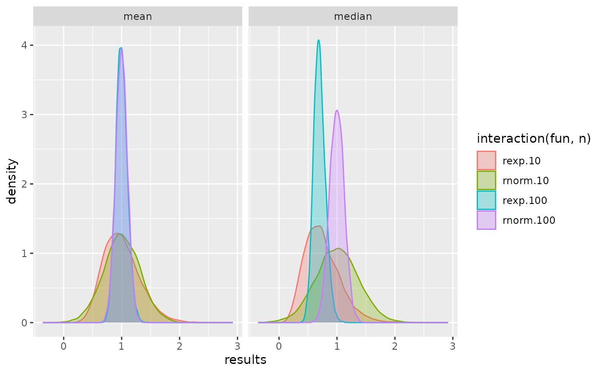
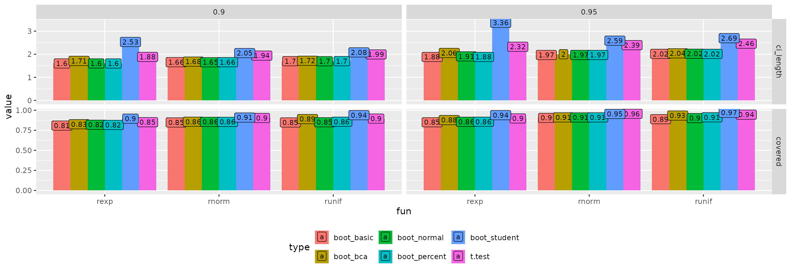

# The simTool package: Facilitate simulations

## A first example

1.  Generate data
2.  Fit different models
3.  Repeat step 1 and 2 three times
4.  Summarize the results with respect to the different data generating
    functions and models by calculating mean and standard deviation for
    the corresponding model terms

``` r
regData <- function(n, SD) {
  x <- seq(0, 1, length = n)
  y <- 10 + 2 * x + rnorm(n, sd = SD)
  tibble(x = x, y = y)
}

eval_tibbles(
  expand_tibble(fun = "regData", n = 5L, SD = 1:2),
  expand_tibble(proc = "lm", formula = c("y~x", "y~I(x^2)")),
  post_analyze = broom::tidy,
  summary_fun = list(mean = mean, sd = sd),
  group_for_summary = "term",
  replications = 3
)
```

    
[38;5;246m# A tibble: 16 × 12
[39m
       fun         n    SD replications summary_fun proc  formula  term     estimate std.error statistic
       
[3m
[38;5;246m<chr>
[39m
[23m   
[3m
[38;5;246m<int>
[39m
[23m 
[3m
[38;5;246m<int>
[39m
[23m        
[3m
[38;5;246m<int>
[39m
[23m 
[3m
[38;5;246m<chr>
[39m
[23m       
[3m
[38;5;246m<chr>
[39m
[23m 
[3m
[38;5;246m<chr>
[39m
[23m    
[3m
[38;5;246m<chr>
[39m
[23m       
[3m
[38;5;246m<dbl>
[39m
[23m     
[3m
[38;5;246m<dbl>
[39m
[23m     
[3m
[38;5;246m<dbl>
[39m
[23m
    
[38;5;250m 1
[39m regData     5     1            1 mean        lm    y~x      (Interc…   10.1      0.692     16.5  
    
[38;5;250m 2
[39m regData     5     1            1 mean        lm    y~x      x           2.92     1.13       3.59 
    
[38;5;250m 3
[39m regData     5     1            1 mean        lm    y~I(x^2) (Interc…   10.5      0.544     20.2  
    
[38;5;250m 4
[39m regData     5     1            1 mean        lm    y~I(x^2) I(x^2)      2.71     1.04       3.20 
    
[38;5;250m 5
[39m regData     5     1            1 sd          lm    y~x      (Interc…    1.45     0.288      6.89 
    
[38;5;250m 6
[39m regData     5     1            1 sd          lm    y~x      x           1.84     0.471      3.71 
    
[38;5;250m 7
[39m regData     5     1            1 sd          lm    y~I(x^2) (Interc…    1.32     0.185      4.38 
    
[38;5;250m 8
[39m regData     5     1            1 sd          lm    y~I(x^2) I(x^2)      2.15     0.352      2.62 
    
[38;5;250m 9
[39m regData     5     2            1 mean        lm    y~x      (Interc…    9.86     1.26       7.85 
    
[38;5;250m10
[39m regData     5     2            1 mean        lm    y~x      x           3.42     2.05       1.66 
    
[38;5;250m11
[39m regData     5     2            1 mean        lm    y~I(x^2) (Interc…   10.6      1.18       8.99 
    
[38;5;250m12
[39m regData     5     2            1 mean        lm    y~I(x^2) I(x^2)      2.65     2.24       1.17 
    
[38;5;250m13
[39m regData     5     2            1 sd          lm    y~x      (Interc…    0.209    0.037
[4m4
[24m     0.393
    
[38;5;250m14
[39m regData     5     2            1 sd          lm    y~x      x           1.17     0.061
[4m0
[24m     0.515
    
[38;5;250m15
[39m regData     5     2            1 sd          lm    y~I(x^2) (Interc…    0.128    0.048
[4m8
[24m     0.436
    
[38;5;250m16
[39m regData     5     2            1 sd          lm    y~I(x^2) I(x^2)      1.32     0.092
[4m7
[24m     0.542
    
[38;5;246m# ℹ 1 more variable: p.value <dbl>
[39m
    Number of data generating functions: 2
    Number of analyzing procedures: 2
    Number of replications: 3
    Estimated replications per hour: 117413
    Start of the simulation: 2026-01-24 07:30:16.633815
    End of the simulation: 2026-01-24 07:30:16.725798

## Introduction

The purpose of the *simTool* package is to disengage the research from
any kind of administrative source code which is usually an annoying
necessity of a simulation study.

This vignette will give an introduction into the *simTool* package
mainly by examples of growing complexity. The workhorse is the function
*eval_tibbles*. Every parameter of this function will be discussed
briefly and the functionality is illustrated by at least one example.

## Workflow

The workflow is quite easy and natural. One defines two *data.frames*
(or *tibbles*), the first one represents the functions that generate the
data sets and the second one represents the functions that analyze the
data. These two *data.frames* are passed to *eval_tibbles* which
conducts the simulation. Afterwards, the results can nicely be displayed
as a *data.frame*.

## Defining the *data.frames* for data generation and analysis

There are 3 rules:

- the first column ( a *character* vector) defines the functions to be
  called
- the other columns are the parameters that are passed to function
  specified in the first column
- The entry *NA* will not be passed to the function specified in the
  first column.

The function *expand_tibble* is a convenient function for defining such
*data.frames*.

We now define the data generation functions for our first simulation.

``` r
print(dg <- dplyr::bind_rows(
  expand_tibble(fun = "rexp", n = c(10L, 20L), rate = 1:2),
  expand_tibble(fun = "rnorm", n = c(10L, 20L), mean = 1:2)
))
```

    
[38;5;246m# A tibble: 8 × 4
[39m
      fun       n  rate  mean
      
[3m
[38;5;246m<chr>
[39m
[23m 
[3m
[38;5;246m<int>
[39m
[23m 
[3m
[38;5;246m<int>
[39m
[23m 
[3m
[38;5;246m<int>
[39m
[23m
    
[38;5;250m1
[39m rexp     10     1    
[31mNA
[39m
    
[38;5;250m2
[39m rexp     20     1    
[31mNA
[39m
    
[38;5;250m3
[39m rexp     10     2    
[31mNA
[39m
    
[38;5;250m4
[39m rexp     20     2    
[31mNA
[39m
    
[38;5;250m5
[39m rnorm    10    
[31mNA
[39m     1
    
[38;5;250m6
[39m rnorm    20    
[31mNA
[39m     1
    
[38;5;250m7
[39m rnorm    10    
[31mNA
[39m     2
    
[38;5;250m8
[39m rnorm    20    
[31mNA
[39m     2

This *data.frame* represents 8 *R*-functions. For instance, the second
row represents a function that generates 20 exponential distributed
random variables with *rate* 1. Since *mean=NA* in the second row, this
parameter is not passed to *rexp*.

Similar, we define the *data.frame* for data analyzing functions.

``` r
print(pg <- dplyr::bind_rows(
  expand_tibble(proc = "min"),
  expand_tibble(proc = "mean", trim = c(0.1, 0.2))
))
```

    
[38;5;246m# A tibble: 3 × 2
[39m
      proc   trim
      
[3m
[38;5;246m<chr>
[39m
[23m 
[3m
[38;5;246m<dbl>
[39m
[23m
    
[38;5;250m1
[39m min    
[31mNA
[39m  
    
[38;5;250m2
[39m mean    0.1
    
[38;5;250m3
[39m mean    0.2

Hence, this *data.frame* represents 3 *R*-functions i.e. calculating the
minimum and the arithmetic mean with *trim=0.1* and *trim=0.2*.

## The workhorse *eval_tibbles*

The workhorse *eval_tibbles* has the following simplified pseudo code:

``` r
1.  convert dg to R-functions  {g_1, ..., g_k} 
2.  convert pg to R-functions  {f_1, ..., f_L} 
3.  initialize result object 
4.  append dg and pg to the result object 
5.  t1 = current.time() 
6.  for g in  {g_1, ..., g_k} 
7.      for r in 1:replications (optionally in a parallel manner) 
8.          data = g() 
9.          for f in  {f_1, \ldots, f_L} 
10.             append f(data) to the result object (optionally apply a post-analyze-function)
11.         optionally append data to the result object 
12.      optionally summarize the result object over all  
         replications but separately for f_1, ..., f_L (and optional group variables)
13. t2 = current.time() 
14. Estimate the number of replications per hour from t1 and t2 
```

The object returned by *eval_tibbles* is a *list* of class
*eval_tibbles*.

``` r
dg <- expand_tibble(fun = "rnorm", n = 10, mean = 1:2)
pg <- expand_tibble(proc = "min")
eg <- eval_tibbles(data_grid = dg, proc_grid = pg, replications = 2)
eg
```

    
[38;5;246m# A tibble: 4 × 6
[39m
      fun       n  mean replications proc  results
      
[3m
[38;5;246m<chr>
[39m
[23m 
[3m
[38;5;246m<dbl>
[39m
[23m 
[3m
[38;5;246m<int>
[39m
[23m        
[3m
[38;5;246m<int>
[39m
[23m 
[3m
[38;5;246m<chr>
[39m
[23m   
[3m
[38;5;246m<dbl>
[39m
[23m
    
[38;5;250m1
[39m rnorm    10     1            1 min    -
[31m1
[39m
[31m.
[39m
[31m75
[39m 
    
[38;5;250m2
[39m rnorm    10     1            2 min    -
[31m0
[39m
[31m.
[39m
[31m212
[39m
    
[38;5;250m3
[39m rnorm    10     2            1 min     0.232
    
[38;5;250m4
[39m rnorm    10     2            2 min     1.16 
    Number of data generating functions: 2
    Number of analyzing procedures: 1
    Number of replications: 2
    Estimated replications per hour: 75876856
    Start of the simulation: 2026-01-24 07:30:17.074415
    End of the simulation: 2026-01-24 07:30:17.07451

As you can see, the function always estimates the number of replications
that can be done in one hour.

### Parameter *replications*

Of course, this parameter controls the number of replications conducted.

``` r
eg <- eval_tibbles(data_grid = dg, proc_grid = pg, replications = 3)
eg
```

    
[38;5;246m# A tibble: 6 × 6
[39m
      fun       n  mean replications proc  results
      
[3m
[38;5;246m<chr>
[39m
[23m 
[3m
[38;5;246m<dbl>
[39m
[23m 
[3m
[38;5;246m<int>
[39m
[23m        
[3m
[38;5;246m<int>
[39m
[23m 
[3m
[38;5;246m<chr>
[39m
[23m   
[3m
[38;5;246m<dbl>
[39m
[23m
    
[38;5;250m1
[39m rnorm    10     1            1 min    -
[31m1
[39m
[31m.
[39m
[31m30
[39m 
    
[38;5;250m2
[39m rnorm    10     1            2 min    -
[31m0
[39m
[31m.
[39m
[31m574
[39m
    
[38;5;250m3
[39m rnorm    10     1            3 min     0.503
    
[38;5;250m4
[39m rnorm    10     2            1 min     0.729
    
[38;5;250m5
[39m rnorm    10     2            2 min     1.06 
    
[38;5;250m6
[39m rnorm    10     2            3 min    -
[31m0
[39m
[31m.
[39m
[31m272
[39m
    Number of data generating functions: 2
    Number of analyzing procedures: 1
    Number of replications: 3
    Estimated replications per hour: 98689505
    Start of the simulation: 2026-01-24 07:30:17.167239
    End of the simulation: 2026-01-24 07:30:17.167348

### Parameter *discard_generated_data*

*eval_tibbles* saves ALL generated data sets.

``` r
eg <- eval_tibbles(data_grid = dg, proc_grid = pg, replications = 1)
eg$simulation
```

    
[38;5;246m# A tibble: 2 × 6
[39m
      fun       n  mean replications proc   results
      
[3m
[38;5;246m<chr>
[39m
[23m 
[3m
[38;5;246m<dbl>
[39m
[23m 
[3m
[38;5;246m<int>
[39m
[23m        
[3m
[38;5;246m<int>
[39m
[23m 
[3m
[38;5;246m<chr>
[39m
[23m    
[3m
[38;5;246m<dbl>
[39m
[23m
    
[38;5;250m1
[39m rnorm    10     1            1 min   -
[31m0
[39m
[31m.
[39m
[31m554
[39m  
    
[38;5;250m2
[39m rnorm    10     2            1 min    0.004
[4m9
[24m
[4m9
[24m

``` r
eg$generated_data
```

    [[1]]
     [1]  1.04382239 -0.02157836  1.79342772  1.50162446 -0.55447035  1.88349784  0.79223220  2.83137401
     [9]  1.17726438  0.19415935

    [[2]]
     [1] 3.947932470 2.121197052 1.645050873 3.052866250 3.163113962 1.201167182 2.775455294 0.004992648
     [9] 1.649437807 2.380864742

In general, it is sometimes very handy to have the data sets in order to
investigate unusual or unexpected results. But saving the generated data
sets can be very memory consuming. Stop saving the generated data sets
can be obtained by setting *discardGeneratedData = TRUE*. See command
line 11 in the pseudo code.

### Parameter *summary_fun*

As stated in command line 12 we can summarize the result objects over
all replications but separately for all data analyzing functions.

``` r
dg <- expand_tibble(fun = "runif", n = c(10, 20, 30))
pg <- expand_tibble(proc = c("min", "max"))
eval_tibbles(
  data_grid = dg, proc_grid = pg, replications = 1000,
  summary_fun = list(mean = mean)
)
```

    
[38;5;246m# A tibble: 6 × 6
[39m
      fun       n replications summary_fun proc   value
      
[3m
[38;5;246m<chr>
[39m
[23m 
[3m
[38;5;246m<dbl>
[39m
[23m        
[3m
[38;5;246m<int>
[39m
[23m 
[3m
[38;5;246m<chr>
[39m
[23m       
[3m
[38;5;246m<chr>
[39m
[23m  
[3m
[38;5;246m<dbl>
[39m
[23m
    
[38;5;250m1
[39m runif    10            1 mean        min   0.090
[4m4
[24m
    
[38;5;250m2
[39m runif    10            1 mean        max   0.910 
    
[38;5;250m3
[39m runif    20            1 mean        min   0.048
[4m6
[24m
    
[38;5;250m4
[39m runif    20            1 mean        max   0.953 
    
[38;5;250m5
[39m runif    30            1 mean        min   0.031
[4m4
[24m
    
[38;5;250m6
[39m runif    30            1 mean        max   0.967 
    Number of data generating functions: 3
    Number of analyzing procedures: 2
    Number of replications: 1000
    Estimated replications per hour: 50090711
    Start of the simulation: 2026-01-24 07:30:17.354204
    End of the simulation: 2026-01-24 07:30:17.426074

``` r
eval_tibbles(
  data_grid = dg, proc_grid = pg, replications = 1000,
  summary_fun = list(mean = mean, sd = sd)
)
```

    
[38;5;246m# A tibble: 12 × 6
[39m
       fun       n replications summary_fun proc   value
       
[3m
[38;5;246m<chr>
[39m
[23m 
[3m
[38;5;246m<dbl>
[39m
[23m        
[3m
[38;5;246m<int>
[39m
[23m 
[3m
[38;5;246m<chr>
[39m
[23m       
[3m
[38;5;246m<chr>
[39m
[23m  
[3m
[38;5;246m<dbl>
[39m
[23m
    
[38;5;250m 1
[39m runif    10            1 mean        min   0.093
[4m0
[24m
    
[38;5;250m 2
[39m runif    10            1 mean        max   0.907 
    
[38;5;250m 3
[39m runif    10            1 sd          min   0.086
[4m5
[24m
    
[38;5;250m 4
[39m runif    10            1 sd          max   0.086
[4m0
[24m
    
[38;5;250m 5
[39m runif    20            1 mean        min   0.046
[4m3
[24m
    
[38;5;250m 6
[39m runif    20            1 mean        max   0.952 
    
[38;5;250m 7
[39m runif    20            1 sd          min   0.042
[4m5
[24m
    
[38;5;250m 8
[39m runif    20            1 sd          max   0.046
[4m8
[24m
    
[38;5;250m 9
[39m runif    30            1 mean        min   0.032
[4m5
[24m
    
[38;5;250m10
[39m runif    30            1 mean        max   0.966 
    
[38;5;250m11
[39m runif    30            1 sd          min   0.032
[4m3
[24m
    
[38;5;250m12
[39m runif    30            1 sd          max   0.031
[4m1
[24m
    Number of data generating functions: 3
    Number of analyzing procedures: 2
    Number of replications: 1000
    Estimated replications per hour: 45995779
    Start of the simulation: 2026-01-24 07:30:17.454743
    End of the simulation: 2026-01-24 07:30:17.533011

Note, by specifying the parameter *summary_fun* the generated data sets
and all individual result objects are discarded. In this example we
discard $3 \times 1000$ data sets and $3 \times 1000 \times 2$
individual result objects.

### Parameter *post_analyze*

Sometimes the analyzing functions return quite complicated objects like
in the Section *A first example*.

``` r
eval_tibbles(
  expand_tibble(fun = "regData", n = 5L, SD = 1:2),
  expand_tibble(proc = "lm", formula = c("y~x", "y~I(x^2)")),
  replications = 2
)
```

    
[38;5;246m# A tibble: 8 × 7
[39m
      fun         n    SD replications proc  formula  results
      
[3m
[38;5;246m<chr>
[39m
[23m   
[3m
[38;5;246m<int>
[39m
[23m 
[3m
[38;5;246m<int>
[39m
[23m        
[3m
[38;5;246m<int>
[39m
[23m 
[3m
[38;5;246m<chr>
[39m
[23m 
[3m
[38;5;246m<chr>
[39m
[23m    
[3m
[38;5;246m<list>
[39m
[23m 
    
[38;5;250m1
[39m regData     5     1            1 lm    y~x      
[38;5;246m<lm>
[39m   
    
[38;5;250m2
[39m regData     5     1            1 lm    y~I(x^2) 
[38;5;246m<lm>
[39m   
    
[38;5;250m3
[39m regData     5     1            2 lm    y~x      
[38;5;246m<lm>
[39m   
    
[38;5;250m4
[39m regData     5     1            2 lm    y~I(x^2) 
[38;5;246m<lm>
[39m   
    
[38;5;250m5
[39m regData     5     2            1 lm    y~x      
[38;5;246m<lm>
[39m   
    
[38;5;250m6
[39m regData     5     2            1 lm    y~I(x^2) 
[38;5;246m<lm>
[39m   
    
[38;5;250m7
[39m regData     5     2            2 lm    y~x      
[38;5;246m<lm>
[39m   
    
[38;5;250m8
[39m regData     5     2            2 lm    y~I(x^2) 
[38;5;246m<lm>
[39m   
    Number of data generating functions: 2
    Number of analyzing procedures: 2
    Number of replications: 2
    Estimated replications per hour: 1043900
    Start of the simulation: 2026-01-24 07:30:17.628306
    End of the simulation: 2026-01-24 07:30:17.635203

The parameter *post_analyze* (if specified) is applied directly after
the result was generated (see command line 10). Note, *purrr::compose*
can be very handy if your post-analyzing-function can be defined by a
few single functions:

``` r
eval_tibbles(
  expand_tibble(fun = "regData", n = 5L, SD = 1:2),
  expand_tibble(proc = "lm", formula = c("y~x", "y~I(x^2)")),
  post_analyze = purrr::compose(function(mat) mat["(Intercept)", "Estimate"], coef, summary.lm),
  replications = 2
)
```

    
[38;5;246m# A tibble: 8 × 7
[39m
      fun         n    SD replications proc  formula  results
      
[3m
[38;5;246m<chr>
[39m
[23m   
[3m
[38;5;246m<int>
[39m
[23m 
[3m
[38;5;246m<int>
[39m
[23m        
[3m
[38;5;246m<int>
[39m
[23m 
[3m
[38;5;246m<chr>
[39m
[23m 
[3m
[38;5;246m<chr>
[39m
[23m      
[3m
[38;5;246m<dbl>
[39m
[23m
    
[38;5;250m1
[39m regData     5     1            1 lm    y~x        10.3 
    
[38;5;250m2
[39m regData     5     1            1 lm    y~I(x^2)   10.2 
    
[38;5;250m3
[39m regData     5     1            2 lm    y~x         9.43
    
[38;5;250m4
[39m regData     5     1            2 lm    y~I(x^2)    9.95
    
[38;5;250m5
[39m regData     5     2            1 lm    y~x        13.5 
    
[38;5;250m6
[39m regData     5     2            1 lm    y~I(x^2)   13.3 
    
[38;5;250m7
[39m regData     5     2            2 lm    y~x         9.27
    
[38;5;250m8
[39m regData     5     2            2 lm    y~I(x^2)    9.25
    Number of data generating functions: 2
    Number of analyzing procedures: 2
    Number of replications: 2
    Estimated replications per hour: 523016
    Start of the simulation: 2026-01-24 07:30:17.80794
    End of the simulation: 2026-01-24 07:30:17.821706

### Parameter *group_for_summary*

When the result object is a *data.frame* itself, for instance

``` r
presever_rownames <- function(mat) {
  rn <- rownames(mat)
  ret <- tibble::as_tibble(mat)
  ret$term <- rn
  ret
}

eval_tibbles(
  expand_tibble(fun = "regData", n = 5L, SD = 1:2),
  expand_tibble(proc = "lm", formula = c("y~x", "y~I(x^2)")),
  post_analyze = purrr::compose(presever_rownames, coef, summary),
  replications = 3
)
```

    
[38;5;246m# A tibble: 24 × 11
[39m
       fun         n    SD replications proc  formula  Estimate `Std. Error` `t value` `Pr(>|t|)` term  
       
[3m
[38;5;246m<chr>
[39m
[23m   
[3m
[38;5;246m<int>
[39m
[23m 
[3m
[38;5;246m<int>
[39m
[23m        
[3m
[38;5;246m<int>
[39m
[23m 
[3m
[38;5;246m<chr>
[39m
[23m 
[3m
[38;5;246m<chr>
[39m
[23m       
[3m
[38;5;246m<dbl>
[39m
[23m        
[3m
[38;5;246m<dbl>
[39m
[23m     
[3m
[38;5;246m<dbl>
[39m
[23m      
[3m
[38;5;246m<dbl>
[39m
[23m 
[3m
[38;5;246m<chr>
[39m
[23m 
    
[38;5;250m 1
[39m regData     5     1            1 lm    y~x          9.91        0.670    14.8     0.000
[4m6
[24m
[4m7
[24m
[4m1
[24m (Inte…
    
[38;5;250m 2
[39m regData     5     1            1 lm    y~x          2.80        1.09      2.56    0.083
[4m1
[24m   x     
    
[38;5;250m 3
[39m regData     5     1            1 lm    y~I(x^2)    10.3         0.577    17.9     0.000
[4m3
[24m
[4m8
[24m
[4m1
[24m (Inte…
    
[38;5;250m 4
[39m regData     5     1            1 lm    y~I(x^2)     2.63        1.10      2.40    0.096
[4m1
[24m   I(x^2)
    
[38;5;250m 5
[39m regData     5     1            2 lm    y~x          9.32        0.537    17.3     0.000
[4m4
[24m
[4m1
[24m
[4m9
[24m (Inte…
    
[38;5;250m 6
[39m regData     5     1            2 lm    y~x          2.11        0.878     2.40    0.096
[4m0
[24m   x     
    
[38;5;250m 7
[39m regData     5     1            2 lm    y~I(x^2)     9.78        0.590    16.6     0.000
[4m4
[24m
[4m7
[24m
[4m8
[24m (Inte…
    
[38;5;250m 8
[39m regData     5     1            2 lm    y~I(x^2)     1.56        1.12      1.39    0.259    I(x^2)
    
[38;5;250m 9
[39m regData     5     1            3 lm    y~x          9.64        1.16      8.28    0.003
[4m6
[24m
[4m9
[24m  (Inte…
    
[38;5;250m10
[39m regData     5     1            3 lm    y~x          1.83        1.90      0.965   0.406    x     
    
[38;5;246m# ℹ 14 more rows
[39m
    Number of data generating functions: 2
    Number of analyzing procedures: 2
    Number of replications: 3
    Estimated replications per hour: 611918
    Start of the simulation: 2026-01-24 07:30:17.919596
    End of the simulation: 2026-01-24 07:30:17.937245

In order to summarize the replications it is necessary to additional
group the calculations with respect to another variable. This variable
can be passed to *group_for_summary*

``` r
eval_tibbles(
  expand_tibble(fun = "regData", n = 5L, SD = 1:2),
  expand_tibble(proc = "lm", formula = c("y~x", "y~I(x^2)")),
  post_analyze = purrr::compose(presever_rownames, coef, summary),
  summary_fun = list(mean = mean, sd = sd),
  group_for_summary = "term",
  replications = 3
)
```

    
[38;5;246m# A tibble: 16 × 12
[39m
       fun         n    SD replications summary_fun proc  formula  term  Estimate `Std. Error` `t value`
       
[3m
[38;5;246m<chr>
[39m
[23m   
[3m
[38;5;246m<int>
[39m
[23m 
[3m
[38;5;246m<int>
[39m
[23m        
[3m
[38;5;246m<int>
[39m
[23m 
[3m
[38;5;246m<chr>
[39m
[23m       
[3m
[38;5;246m<chr>
[39m
[23m 
[3m
[38;5;246m<chr>
[39m
[23m    
[3m
[38;5;246m<chr>
[39m
[23m    
[3m
[38;5;246m<dbl>
[39m
[23m        
[3m
[38;5;246m<dbl>
[39m
[23m     
[3m
[38;5;246m<dbl>
[39m
[23m
    
[38;5;250m 1
[39m regData     5     1            1 mean        lm    y~x      (Int…    9.95         0.500     53.5 
    
[38;5;250m 2
[39m regData     5     1            1 mean        lm    y~x      x        2.04         0.817      6.86
    
[38;5;250m 3
[39m regData     5     1            1 mean        lm    y~I(x^2) (Int…   10.3          0.444     28.5 
    
[38;5;250m 4
[39m regData     5     1            1 mean        lm    y~I(x^2) I(x^…    1.93         0.845      2.80
    
[38;5;250m 5
[39m regData     5     1            1 sd          lm    y~x      (Int…    0.505        0.404     66.9 
    
[38;5;250m 6
[39m regData     5     1            1 sd          lm    y~x      x        0.382        0.660      8.87
    
[38;5;250m 7
[39m regData     5     1            1 sd          lm    y~I(x^2) (Int…    0.608        0.202     17.8 
    
[38;5;250m 8
[39m regData     5     1            1 sd          lm    y~I(x^2) I(x^…    0.759        0.385      1.87
    
[38;5;250m 9
[39m regData     5     2            1 mean        lm    y~x      (Int…    9.38         0.787     13.6 
    
[38;5;250m10
[39m regData     5     2            1 mean        lm    y~x      x        3.28         1.28       2.80
    
[38;5;250m11
[39m regData     5     2            1 mean        lm    y~I(x^2) (Int…    9.99         0.823     14.1 
    
[38;5;250m12
[39m regData     5     2            1 mean        lm    y~I(x^2) I(x^…    2.74         1.57       1.79
    
[38;5;250m13
[39m regData     5     2            1 sd          lm    y~x      (Int…    1.06         0.271      7.18
    
[38;5;250m14
[39m regData     5     2            1 sd          lm    y~x      x        3.14         0.443      2.41
    
[38;5;250m15
[39m regData     5     2            1 sd          lm    y~I(x^2) (Int…    0.862        0.365      6.91
    
[38;5;250m16
[39m regData     5     2            1 sd          lm    y~I(x^2) I(x^…    2.74         0.694      1.73
    
[38;5;246m# ℹ 1 more variable: `Pr(>|t|)` <dbl>
[39m
    Number of data generating functions: 2
    Number of analyzing procedures: 2
    Number of replications: 3
    Estimated replications per hour: 204272
    Start of the simulation: 2026-01-24 07:30:18.04142
    End of the simulation: 2026-01-24 07:30:18.09429

### Parameter *ncpus* and *cluster_seed*

By specifying *ncpus* larger than 1 a cluster objected is created for
the user and passed to the parameter *cluster* discussed in the next
section.

``` r
eval_tibbles(
  data_grid = dg, proc_grid = pg, replications = 10,
  ncpus = 2, summary_fun = list(mean = mean)
)
```

    
[38;5;246m# A tibble: 6 × 6
[39m
      fun       n replications summary_fun proc   value
      
[3m
[38;5;246m<chr>
[39m
[23m 
[3m
[38;5;246m<dbl>
[39m
[23m        
[3m
[38;5;246m<int>
[39m
[23m 
[3m
[38;5;246m<chr>
[39m
[23m       
[3m
[38;5;246m<chr>
[39m
[23m  
[3m
[38;5;246m<dbl>
[39m
[23m
    
[38;5;250m1
[39m runif    10            1 mean        min   0.088
[4m4
[24m
    
[38;5;250m2
[39m runif    10            1 mean        max   0.912 
    
[38;5;250m3
[39m runif    20            1 mean        min   0.065
[4m6
[24m
    
[38;5;250m4
[39m runif    20            1 mean        max   0.947 
    
[38;5;250m5
[39m runif    30            1 mean        min   0.036
[4m2
[24m
    
[38;5;250m6
[39m runif    30            1 mean        max   0.969 
    Number of data generating functions: 3
    Number of analyzing procedures: 2
    Number of replications: 10
    Estimated replications per hour: 92637
    Start of the simulation: 2026-01-24 07:30:18.438831
    End of the simulation: 2026-01-24 07:30:18.827441

As it is stated in command line 7, the replications are parallelized. In
our case, this means that roughly every CPU conducts 5 replications.

The parameter *cluster_seed* must be an integer vector of length 6 and
serves the same purpose as the function *set.seed*. By default,
*cluster_seed* equals *rep(12345, 6)*. Note, in order to reproduce the
simulation study it is also necessary that *ncpus* does not change.

### Parameter *cluster*

The user can create a cluster on its own. This also enables the user to
distribute the replications over different computers in a network.

``` r
library(parallel)
cl <- makeCluster(rep("localhost", 2), type = "PSOCK")
eval_tibbles(
  data_grid = dg, proc_grid = pg, replications = 10,
  cluster = cl, summary_fun = list(mean = mean)
)
```

    
[38;5;246m# A tibble: 6 × 6
[39m
      fun       n replications summary_fun proc   value
      
[3m
[38;5;246m<chr>
[39m
[23m 
[3m
[38;5;246m<dbl>
[39m
[23m        
[3m
[38;5;246m<int>
[39m
[23m 
[3m
[38;5;246m<chr>
[39m
[23m       
[3m
[38;5;246m<chr>
[39m
[23m  
[3m
[38;5;246m<dbl>
[39m
[23m
    
[38;5;250m1
[39m runif    10            1 mean        min   0.088
[4m4
[24m
    
[38;5;250m2
[39m runif    10            1 mean        max   0.912 
    
[38;5;250m3
[39m runif    20            1 mean        min   0.065
[4m6
[24m
    
[38;5;250m4
[39m runif    20            1 mean        max   0.947 
    
[38;5;250m5
[39m runif    30            1 mean        min   0.036
[4m2
[24m
    
[38;5;250m6
[39m runif    30            1 mean        max   0.969 
    Number of data generating functions: 3
    Number of analyzing procedures: 2
    Number of replications: 10
    Estimated replications per hour: 92127
    Start of the simulation: 2026-01-24 07:30:19.178495
    End of the simulation: 2026-01-24 07:30:19.569258

``` r
stopCluster(cl)
```

As you can see our cluster consists of 3 workers. Hence, this reproduces
the results from the last code chunk above. Further note, if the user
starts the cluster, the user also has to stop the cluster. A cluster
that is created within *eval_tibbles* by specifying *ncpus* is also stop
within *eval_tibbles*.

### Parameter *cluster_libraries* and *cluster_global_objects*

A newly created cluster is \`\`empty’’. Hence, if the simulation study
requires libraries or objects from the global environment, they must be
transferred to the cluster.

Lets look at standard example from the *boot* package.

``` r
library(boot)
ratio <- function(d, w) sum(d$x * w) / sum(d$u * w)
city.boot <- boot(city, ratio,
  R = 999, stype = "w",
  sim = "ordinary"
)
boot.ci(city.boot,
  conf = c(0.90, 0.95),
  type = c("norm", "basic", "perc", "bca")
)
```

    BOOTSTRAP CONFIDENCE INTERVAL CALCULATIONS
    Based on 999 bootstrap replicates

    CALL : 
    boot.ci(boot.out = city.boot, conf = c(0.9, 0.95), type = c("norm", 
        "basic", "perc", "bca"))

    Intervals : 
    Level      Normal              Basic         
    90%   ( 1.098,  1.861 )   ( 1.047,  1.772 )   
    95%   ( 1.026,  1.934 )   ( 0.860,  1.799 )  

    Level     Percentile            BCa          
    90%   ( 1.268,  1.994 )   ( 1.271,  2.002 )   
    95%   ( 1.241,  2.180 )   ( 1.242,  2.195 )  
    Calculations and Intervals on Original Scale

The following data generating function is extremely boring because it
always returns the data set *city* from the library *boot*.

``` r
returnCity <- function() {
  city
}
bootConfInt <- function(data) {
  city.boot <- boot(data, ratio,
    R = 999, stype = "w",
    sim = "ordinary"
  )
  boot.ci(city.boot,
    conf = c(0.90, 0.95),
    type = c("norm", "basic", "perc", "bca")
  )
}
```

The function *ratio* exists at the moment only in our global
environment. Further we had to load the *boot* package. Hence, we load
the *boot* package by setting *cluster_libraries = c(“boot”)* and
transfer the function *ratio* by setting *cluster_global_objects =
c(“ratio”)*.

``` r
dg <- expand_tibble(fun = "returnCity")
pg <- expand_tibble(proc = "bootConfInt")
eval_tibbles(dg, pg,
  replications = 10, ncpus = 2,
  cluster_libraries = c("boot"),
  cluster_global_objects = c("ratio")
)
```

    
[38;5;246m# A tibble: 10 × 4
[39m
       fun        replications proc        results 
       
[3m
[38;5;246m<chr>
[39m
[23m             
[3m
[38;5;246m<int>
[39m
[23m 
[3m
[38;5;246m<chr>
[39m
[23m       
[3m
[38;5;246m<list>
[39m
[23m  
    
[38;5;250m 1
[39m returnCity            1 bootConfInt 
[38;5;246m<bootci>
[39m
    
[38;5;250m 2
[39m returnCity            2 bootConfInt 
[38;5;246m<bootci>
[39m
    
[38;5;250m 3
[39m returnCity            3 bootConfInt 
[38;5;246m<bootci>
[39m
    
[38;5;250m 4
[39m returnCity            4 bootConfInt 
[38;5;246m<bootci>
[39m
    
[38;5;250m 5
[39m returnCity            5 bootConfInt 
[38;5;246m<bootci>
[39m
    
[38;5;250m 6
[39m returnCity            6 bootConfInt 
[38;5;246m<bootci>
[39m
    
[38;5;250m 7
[39m returnCity            7 bootConfInt 
[38;5;246m<bootci>
[39m
    
[38;5;250m 8
[39m returnCity            8 bootConfInt 
[38;5;246m<bootci>
[39m
    
[38;5;250m 9
[39m returnCity            9 bootConfInt 
[38;5;246m<bootci>
[39m
    
[38;5;250m10
[39m returnCity           10 bootConfInt 
[38;5;246m<bootci>
[39m
    Number of data generating functions: 1
    Number of analyzing procedures: 1
    Number of replications: 10
    Estimated replications per hour: 202386
    Start of the simulation: 2026-01-24 07:30:20.39931
    End of the simulation: 2026-01-24 07:30:20.577187

Of course, it is possible to set *cluster_global_objects=ls()*, but then
all objects from the global environment are transferred to all workers.

### Parameter *envir*

The function *eval_tibbles* generates in a first step function calls
from *data_grid* and *proc_grid*. This is achieved by applying the
*R*-function *get*. By default, *envir=globalenv()* and thus *get*
searches the global environment of the current R session. An example
shows how to use the parameter *envir*.

``` r
# masking summary from the base package
summary <- function(x) tibble(sd = sd(x))
g <- function(x) tibble(q0.1 = quantile(x, 0.1))
someFunc <- function() {
  summary <- function(x) tibble(sd = sd(x), mean = mean(x))

  dg <- expand_tibble(fun = "runif", n = 100)
  pg <- expand_tibble(proc = c("summary", "g"))

  # the standard is to use the global
  # environment, hence summary defined outside
  # of someFunc() will be used
  print(eval_tibbles(dg, pg))
  cat("--------------------------------------------------\n")
  # will use the local defined summary, but g
  # from the global environment, because
  # g is not locally defined.
  print(eval_tibbles(dg, pg, envir = environment()))
}
someFunc()
```

    
[38;5;246m# A tibble: 2 × 6
[39m
      fun       n replications proc        sd   q0.1
      
[3m
[38;5;246m<chr>
[39m
[23m 
[3m
[38;5;246m<dbl>
[39m
[23m        
[3m
[38;5;246m<int>
[39m
[23m 
[3m
[38;5;246m<chr>
[39m
[23m    
[3m
[38;5;246m<dbl>
[39m
[23m  
[3m
[38;5;246m<dbl>
[39m
[23m
    
[38;5;250m1
[39m runif   100            1 summary  0.260 
[31mNA
[39m    
    
[38;5;250m2
[39m runif   100            1 g       
[31mNA
[39m      0.123
    Number of data generating functions: 1
    Number of analyzing procedures: 2
    Number of replications: 1
    Estimated replications per hour: 2071545
    Start of the simulation: 2026-01-24 07:30:20.747182
    End of the simulation: 2026-01-24 07:30:20.74892
    --------------------------------------------------
    
[38;5;246m# A tibble: 2 × 7
[39m
      fun       n replications proc        sd   mean   q0.1
      
[3m
[38;5;246m<chr>
[39m
[23m 
[3m
[38;5;246m<dbl>
[39m
[23m        
[3m
[38;5;246m<int>
[39m
[23m 
[3m
[38;5;246m<chr>
[39m
[23m    
[3m
[38;5;246m<dbl>
[39m
[23m  
[3m
[38;5;246m<dbl>
[39m
[23m  
[3m
[38;5;246m<dbl>
[39m
[23m
    
[38;5;250m1
[39m runif   100            1 summary  0.282  0.512 
[31mNA
[39m    
    
[38;5;250m2
[39m runif   100            1 g       
[31mNA
[39m     
[31mNA
[39m      0.147
    Number of data generating functions: 1
    Number of analyzing procedures: 2
    Number of replications: 1
    Estimated replications per hour: 2650429
    Start of the simulation: 2026-01-24 07:30:20.779642
    End of the simulation: 2026-01-24 07:30:20.781

### .truth-functionality

Sometimes it is handy to access the parameter constellation that was
used during the data generation in the (post) data analyzing phase. Of
course, one could write wrapper functions for every data generating
function and append the parameter constellation from the data generation
as attributes to the data set, but the purpose of this package is to
reduce such administrative source code. Hence if the (post) data
analyzing function has an argument *.truth*, then *eval_tibbles* will
manage that hand-over. A brief example should explain this. Suppose we
want to estimate the bias of the empirical quantile estimator if the
data is normal distributed.

``` r
dg <- expand_tibble(fun = c("rnorm"), mean = c(1,1000), sd = c(1,10), n = c(10L, 100L))
pg <- expand_tibble(proc = "quantile", probs = 0.975)
post_ana <- function(q_est, .truth){
  tibble::tibble(bias = q_est - stats::qnorm(0.975, mean = .truth$mean, sd = .truth$sd))
}
eval_tibbles(dg, pg, replications = 10^3, discard_generated_data = TRUE,
                   ncpus = 2,
                   post_analyze = post_ana,
                   summary_fun = list(mean = mean))
```

    
[38;5;246m# A tibble: 8 × 9
[39m
      fun    mean    sd     n replications summary_fun proc     probs    bias
      
[3m
[38;5;246m<chr>
[39m
[23m 
[3m
[38;5;246m<dbl>
[39m
[23m 
[3m
[38;5;246m<dbl>
[39m
[23m 
[3m
[38;5;246m<int>
[39m
[23m        
[3m
[38;5;246m<int>
[39m
[23m 
[3m
[38;5;246m<chr>
[39m
[23m       
[3m
[38;5;246m<chr>
[39m
[23m    
[3m
[38;5;246m<dbl>
[39m
[23m   
[3m
[38;5;246m<dbl>
[39m
[23m
    
[38;5;250m1
[39m rnorm     1     1    10            1 mean        quantile 0.975 -
[31m0
[39m
[31m.
[39m
[31m573
[39m 
    
[38;5;250m2
[39m rnorm  
[4m1
[24m000     1    10            1 mean        quantile 0.975 -
[31m0
[39m
[31m.
[39m
[31m550
[39m 
    
[38;5;250m3
[39m rnorm     1    10    10            1 mean        quantile 0.975 -
[31m5
[39m
[31m.
[39m
[31m58
[39m  
    
[38;5;250m4
[39m rnorm  
[4m1
[24m000    10    10            1 mean        quantile 0.975 -
[31m5
[39m
[31m.
[39m
[31m34
[39m  
    
[38;5;250m5
[39m rnorm     1     1   100            1 mean        quantile 0.975 -
[31m0
[39m
[31m.
[39m
[31m0
[39m
[31m76
[4m0
[24m
[39m
    
[38;5;250m6
[39m rnorm  
[4m1
[24m000     1   100            1 mean        quantile 0.975 -
[31m0
[39m
[31m.
[39m
[31m0
[39m
[31m87
[4m9
[24m
[39m
    
[38;5;250m7
[39m rnorm     1    10   100            1 mean        quantile 0.975 -
[31m0
[39m
[31m.
[39m
[31m685
[39m 
    
[38;5;250m8
[39m rnorm  
[4m1
[24m000    10   100            1 mean        quantile 0.975 -
[31m0
[39m
[31m.
[39m
[31m695
[39m 
    Number of data generating functions: 8
    Number of analyzing procedures: 1
    Number of replications: 1000
    Estimated replications per hour: 1140459
    Start of the simulation: 2026-01-24 07:30:21.134018
    End of the simulation: 2026-01-24 07:30:24.29064

If we want to do the analysis for different distrubtions we could modify
our post data analyzing function, but we can also simply add a
*.truth*-column to the data generating grid. In this case, the
information from the *.truth*-column is directly passed to the
*.truth*-parameter:

``` r
dg <- dplyr::bind_rows(
  expand_tibble(fun = c("rnorm"), mean = 0, n = c(10L, 100L), .truth = qnorm(0.975)),
  expand_tibble(fun = c("rexp"), rate = 1, n = c(10L, 100L), .truth = qexp(0.975, rate = 1)),
  expand_tibble(fun = c("runif"), max = 2, n = c(10L, 100L), .truth = qunif(0.975, max = 2))
)
pg <- expand_tibble(proc = "quantile", probs = 0.975)
post_ana <- function(q_est, .truth){
  ret <- q_est - .truth
  names(ret) <- "bias"
  ret
}
eval_tibbles(dg, pg, replications = 10^3, discard_generated_data = TRUE,
                   ncpus = 2,
                   post_analyze = post_ana,
                   summary_fun = list(mean = mean))
```

    
[38;5;246m# A tibble: 6 × 11
[39m
      fun    mean     n .truth  rate   max replications summary_fun proc     probs    bias
      
[3m
[38;5;246m<chr>
[39m
[23m 
[3m
[38;5;246m<dbl>
[39m
[23m 
[3m
[38;5;246m<int>
[39m
[23m  
[3m
[38;5;246m<dbl>
[39m
[23m 
[3m
[38;5;246m<dbl>
[39m
[23m 
[3m
[38;5;246m<dbl>
[39m
[23m        
[3m
[38;5;246m<int>
[39m
[23m 
[3m
[38;5;246m<chr>
[39m
[23m       
[3m
[38;5;246m<chr>
[39m
[23m    
[3m
[38;5;246m<dbl>
[39m
[23m   
[3m
[38;5;246m<dbl>
[39m
[23m
    
[38;5;250m1
[39m rnorm     0    10   1.96    
[31mNA
[39m    
[31mNA
[39m            1 mean        quantile 0.975 -
[31m0
[39m
[31m.
[39m
[31m573
[39m 
    
[38;5;250m2
[39m rnorm     0   100   1.96    
[31mNA
[39m    
[31mNA
[39m            1 mean        quantile 0.975 -
[31m0
[39m
[31m.
[39m
[31m0
[39m
[31m81
[4m8
[24m
[39m
    
[38;5;250m3
[39m rexp     
[31mNA
[39m    10   3.69     1    
[31mNA
[39m            1 mean        quantile 0.975 -
[31m0
[39m
[31m.
[39m
[31m917
[39m 
    
[38;5;250m4
[39m rexp     
[31mNA
[39m   100   3.69     1    
[31mNA
[39m            1 mean        quantile 0.975 -
[31m0
[39m
[31m.
[39m
[31m175
[39m 
    
[38;5;250m5
[39m runif    
[31mNA
[39m    10   1.95    
[31mNA
[39m     2            1 mean        quantile 0.975 -
[31m0
[39m
[31m.
[39m
[31m174
[39m 
    
[38;5;250m6
[39m runif    
[31mNA
[39m   100   1.95    
[31mNA
[39m     2            1 mean        quantile 0.975 -
[31m0
[39m
[31m.
[39m
[31m0
[39m
[31m18
[4m3
[24m
[39m
    Number of data generating functions: 6
    Number of analyzing procedures: 1
    Number of replications: 1000
    Estimated replications per hour: 2725648
    Start of the simulation: 2026-01-24 07:30:24.662288
    End of the simulation: 2026-01-24 07:30:25.983075

In the same fashion one could write a data analyzing function with a
parameter *.truth*. To go even a step further, we store the analytic
quantile function in the *.truth* column:

``` r
dg <- dplyr::bind_rows(
  expand_tibble(fun = c("rnorm"), mean = 0, n = c(10L, 1000L), 
                .truth = list(function(prob) qnorm(prob, mean = 0))),
  expand_tibble(fun = c("rexp"), rate = 1, n = c(10L, 1000L),
                .truth = list(function(prob) qexp(prob, rate = 1))),
  expand_tibble(fun = c("runif"), max = 2, n = c(10L, 1000L),
                .truth = list(function(prob) qunif(prob, max = 2)))
)
bias_quantile <- function(x, prob, .truth) {
  est <- quantile(x, probs = prob)
  ret <- est - .truth[[1]](prob)
  names(ret) <- "bias"
  ret
}
pg <- expand_tibble(proc = "bias_quantile", prob = c(0.9, 0.975))
eval_tibbles(dg, pg, replications = 10^3, discard_generated_data = TRUE,
                   ncpus = 1,
                   summary_fun = list(mean = mean))
```

    
[38;5;246m# A tibble: 12 × 11
[39m
       fun    mean     n .truth  rate   max replications summary_fun proc           prob      bias
       
[3m
[38;5;246m<chr>
[39m
[23m 
[3m
[38;5;246m<dbl>
[39m
[23m 
[3m
[38;5;246m<int>
[39m
[23m 
[3m
[38;5;246m<list>
[39m
[23m 
[3m
[38;5;246m<dbl>
[39m
[23m 
[3m
[38;5;246m<dbl>
[39m
[23m        
[3m
[38;5;246m<int>
[39m
[23m 
[3m
[38;5;246m<chr>
[39m
[23m       
[3m
[38;5;246m<chr>
[39m
[23m         
[3m
[38;5;246m<dbl>
[39m
[23m     
[3m
[38;5;246m<dbl>
[39m
[23m
    
[38;5;250m 1
[39m rnorm     0    10 
[38;5;246m<fn>
[39m      
[31mNA
[39m    
[31mNA
[39m            1 mean        bias_quantile 0.9   -
[31m0
[39m
[31m.
[39m
[31m218
[39m   
    
[38;5;250m 2
[39m rnorm     0    10 
[38;5;246m<fn>
[39m      
[31mNA
[39m    
[31mNA
[39m            1 mean        bias_quantile 0.975 -
[31m0
[39m
[31m.
[39m
[31m530
[39m   
    
[38;5;250m 3
[39m rnorm     0  
[4m1
[24m000 
[38;5;246m<fn>
[39m      
[31mNA
[39m    
[31mNA
[39m            1 mean        bias_quantile 0.9   -
[31m0
[39m
[31m.
[39m
[31m00
[39m
[31m6
[4m2
[24m
[4m6
[24m
[39m 
    
[38;5;250m 4
[39m rnorm     0  
[4m1
[24m000 
[38;5;246m<fn>
[39m      
[31mNA
[39m    
[31mNA
[39m            1 mean        bias_quantile 0.975 -
[31m0
[39m
[31m.
[39m
[31m0
[39m
[31m10
[4m6
[24m
[39m  
    
[38;5;250m 5
[39m rexp     
[31mNA
[39m    10 
[38;5;246m<fn>
[39m       1    
[31mNA
[39m            1 mean        bias_quantile 0.9   -
[31m0
[39m
[31m.
[39m
[31m275
[39m   
    
[38;5;250m 6
[39m rexp     
[31mNA
[39m    10 
[38;5;246m<fn>
[39m       1    
[31mNA
[39m            1 mean        bias_quantile 0.975 -
[31m0
[39m
[31m.
[39m
[31m983
[39m   
    
[38;5;250m 7
[39m rexp     
[31mNA
[39m  
[4m1
[24m000 
[38;5;246m<fn>
[39m       1    
[31mNA
[39m            1 mean        bias_quantile 0.9   -
[31m0
[39m
[31m.
[39m
[31m00
[39m
[31m2
[4m2
[24m
[4m6
[24m
[39m 
    
[38;5;250m 8
[39m rexp     
[31mNA
[39m  
[4m1
[24m000 
[38;5;246m<fn>
[39m       1    
[31mNA
[39m            1 mean        bias_quantile 0.975 -
[31m0
[39m
[31m.
[39m
[31m0
[39m
[31m21
[4m7
[24m
[39m  
    
[38;5;250m 9
[39m runif    
[31mNA
[39m    10 
[38;5;246m<fn>
[39m      
[31mNA
[39m     2            1 mean        bias_quantile 0.9   -
[31m0
[39m
[31m.
[39m
[31m150
[39m   
    
[38;5;250m10
[39m runif    
[31mNA
[39m    10 
[38;5;246m<fn>
[39m      
[31mNA
[39m     2            1 mean        bias_quantile 0.975 -
[31m0
[39m
[31m.
[39m
[31m173
[39m   
    
[38;5;250m11
[39m runif    
[31mNA
[39m  
[4m1
[24m000 
[38;5;246m<fn>
[39m      
[31mNA
[39m     2            1 mean        bias_quantile 0.9   -
[31m0
[39m
[31m.
[39m
[31m000
[39m
[31m
[4m5
[24m
[4m2
[24m
[4m4
[24m
[39m
    
[38;5;250m12
[39m runif    
[31mNA
[39m  
[4m1
[24m000 
[38;5;246m<fn>
[39m      
[31mNA
[39m     2            1 mean        bias_quantile 0.975 -
[31m0
[39m
[31m.
[39m
[31m00
[39m
[31m2
[4m0
[24m
[4m1
[24m
[39m 
    Number of data generating functions: 6
    Number of analyzing procedures: 2
    Number of replications: 1000
    Estimated replications per hour: 1945234
    Start of the simulation: 2026-01-24 07:30:26.112397
    End of the simulation: 2026-01-24 07:30:27.963073

But one should keep in mind that if one calculates the quantile during
the (post) analyzing phase that this is happens on replication level. To
be more precise lets look at an excerpt of the pseudo code from the
beginning of the vignette:

``` r
6.  for g in  {g_1, ..., g_k} 
7.      for r in 1:replications (optionally in a parallel manner) 
8.          data = g() 
9.          for f in  {f_1, \ldots, f_L} 
10.             append f(data) to the result object (optionally apply a post-analyze-function)
```

No matter if one extend the data analyzing function *f_1, … f_L* or the
post-analyze-function with an argument *.truth* the calculation are made
for every single replication during step 10. Hence, the operations are
not vectorized!

## Some Examples

Note, the following code examples will use more computational resources.
In order to prevent that these are checked/executed on the CRAN check
farm, they are only evaluated if the environment variable *NOT_CRAN* is
set to “true”

``` r
EVAL <- FALSE
if (Sys.getenv("NOT_CRAN") == "true") {
  EVAL <- TRUE
}
```

### Sampling distribution of mean and median for normal and exponential distributed data

First we define how the data is generated, where the sample size should
be 10 and 100:

``` r
dg <- dplyr::bind_rows(
  expand_tibble(fun = c("rnorm"), mean = 1, n = c(10L, 100L)),
  expand_tibble(fun = c("rexp"), rate = 1, n = c(10L, 100L))
)
dg
```

    
[38;5;246m# A tibble: 4 × 4
[39m
      fun    mean     n  rate
      
[3m
[38;5;246m<chr>
[39m
[23m 
[3m
[38;5;246m<dbl>
[39m
[23m 
[3m
[38;5;246m<int>
[39m
[23m 
[3m
[38;5;246m<dbl>
[39m
[23m
    
[38;5;250m1
[39m rnorm     1    10    
[31mNA
[39m
    
[38;5;250m2
[39m rnorm     1   100    
[31mNA
[39m
    
[38;5;250m3
[39m rexp     
[31mNA
[39m    10     1
    
[38;5;250m4
[39m rexp     
[31mNA
[39m   100     1

Afterwards we define how we want to analyze the data:

``` r
pg <- expand_tibble(proc = c("mean", "median"))
pg
```

    
[38;5;246m# A tibble: 2 × 1
[39m
      proc  
      
[3m
[38;5;246m<chr>
[39m
[23m 
    
[38;5;250m1
[39m mean  
    
[38;5;250m2
[39m median

Finally, we conduct the simulation and visualize the results

``` r
et <- eval_tibbles(dg, pg, replications = 10^4, ncpus = 2)

et$simulation %>%
  ggplot(aes(x = results, color = interaction(fun, n), fill = interaction(fun, n))) +
  geom_density(alpha = 0.3) +
  facet_wrap(~ proc)
```



### Comparing bootstrap confidence intervals with classical studentized interval

We want to compare the confidence intervals that are generated by
*boot::boot.ci()* and *stats::t.test()*. Unfortunately,
*boot::boot.ci()* cannot be applied directly to the generated data sets.
Therefore, we write a new function:

``` r
bootstrap_ci <- function(x, conf.level, R = 999) {
  b <- boot::boot(x, function(d, i) {
    n <- length(i)
    c(
      mean = mean(d[i]),
      variance = (n - 1) * var(d[i]) / n^2
    )
  }, R = R)
  boot::boot.ci(b, conf = conf.level, type = "all")
}
```

Furthermore, *boot::boot.ci()* returns in general more than one
confidence interval and the structures returned by *boot::boot.ci()* and
*stats::t.test()* are also very different. One solution could be to
write a function *t_test()* that calls *stats::t.test()*, modifies the
returned object and additionally modify the function *bootstrap_ci* so
that both function return objects with a unified structure. But instead
of that we will implement a function that is later on passed to the
argument *post_analyze* of *eval_tibbles*:

``` r
post_analyze <- function(o, .truth) {
  if (class(o) == "htest") {
  #post-process the object returned by t.test
    ci <- o$conf.int
    return(tibble::tibble(
      type = "t.test",
      aspect = c("covered", "ci_length"),
      value = c(ci[1] <= .truth && .truth <= ci[2], ci[2] - ci[1])
    ))
  } else if (class(o) == "bootci") {
  #post-process the object returned by boot.ci
    method = c("normal", "basic", "student", "percent", "bca")
    ret = o[method]
    lower = unlist(purrr::map(ret, ~dplyr::nth(.x[1,], -2)))
    upper = unlist(purrr::map(ret, ~dplyr::nth(.x[1,], -1)))
    type = paste("boot", method, sep = "_")

    return(
      dplyr::bind_rows(
      tibble::tibble(
        type = type, 
        aspect = "covered", 
        value = as.integer(lower <= .truth & .truth <= upper)),
      tibble::tibble(
        type = type, 
        aspect = "ci_length", 
        value = upper - lower))
    )
  }
}
```

As you can see, the objects returned are tibbles with more than one row.
Summarizing the data over all replications will in general use the
variable *type* and *aspect* as grouping variables. This can be achieved
by using the parameter *group_for_summary* of *eval_tibbles*.

#### Define and run the simulation

We want to generate normal-, uniform-, and exponential distributed data:

``` r
dg <- dplyr::bind_rows(
  simTool::expand_tibble(fun = "rnorm", n = 10L, mean = 0, sd = sqrt(3), .truth = 0),
  simTool::expand_tibble(fun = "runif", n = 10L, max = 6, .truth = 3),
  simTool::expand_tibble(fun = "rexp", n = 10L, rate = 1 / sqrt(3), .truth = sqrt(3))
)
dg
```

    
[38;5;246m# A tibble: 3 × 7
[39m
      fun       n  mean    sd .truth   max   rate
      
[3m
[38;5;246m<chr>
[39m
[23m 
[3m
[38;5;246m<int>
[39m
[23m 
[3m
[38;5;246m<dbl>
[39m
[23m 
[3m
[38;5;246m<dbl>
[39m
[23m  
[3m
[38;5;246m<dbl>
[39m
[23m 
[3m
[38;5;246m<dbl>
[39m
[23m  
[3m
[38;5;246m<dbl>
[39m
[23m
    
[38;5;250m1
[39m rnorm    10     0  1.73   0       
[31mNA
[39m 
[31mNA
[39m    
    
[38;5;250m2
[39m runif    10    
[31mNA
[39m 
[31mNA
[39m      3        6 
[31mNA
[39m    
    
[38;5;250m3
[39m rexp     10    
[31mNA
[39m 
[31mNA
[39m      1.73    
[31mNA
[39m  0.577

and apply our functions that calculate the confidence intervals to it
using two different confidence levels.

``` r
pg <- simTool::expand_tibble(
  proc = c("t.test","bootstrap_ci"),
  conf.level = c(0.9, 0.95)
)
pg
```

    
[38;5;246m# A tibble: 4 × 2
[39m
      proc         conf.level
      
[3m
[38;5;246m<chr>
[39m
[23m             
[3m
[38;5;246m<dbl>
[39m
[23m
    
[38;5;250m1
[39m t.test             0.9 
    
[38;5;250m2
[39m bootstrap_ci       0.9 
    
[38;5;250m3
[39m t.test             0.95
    
[38;5;250m4
[39m bootstrap_ci       0.95

Note, that the structure of the objects returned are quite different
which addressed by our function *post_analyze*. The variables *type* and
*aspect* that are created by *post_analyze* are to distinguish the
different confidence intervals. Since these variables are part of the
result objects, *eval_tibbles* assumes that these variables are results.
In order to summarize the results (calculating the mean) over all
replications correctly we need to tell eval_tibbles that additional
group variables are *type* and *aspect*:

``` r
et <- eval_tibbles(dg, pg,
  replications = 10^3, ncpus = 2,
  cluster_global_objects = "post_analyze",
  post_analyze = post_analyze,
  summary_fun = list(mean = mean),
  group_for_summary = c("aspect", "type")
)
et
```

    
[38;5;246m# A tibble: 72 × 14
[39m
       fun       n  mean    sd .truth   max  rate replications summary_fun proc  conf.level aspect type 
       
[3m
[38;5;246m<chr>
[39m
[23m 
[3m
[38;5;246m<int>
[39m
[23m 
[3m
[38;5;246m<dbl>
[39m
[23m 
[3m
[38;5;246m<dbl>
[39m
[23m  
[3m
[38;5;246m<dbl>
[39m
[23m 
[3m
[38;5;246m<dbl>
[39m
[23m 
[3m
[38;5;246m<dbl>
[39m
[23m        
[3m
[38;5;246m<int>
[39m
[23m 
[3m
[38;5;246m<chr>
[39m
[23m       
[3m
[38;5;246m<chr>
[39m
[23m      
[3m
[38;5;246m<dbl>
[39m
[23m 
[3m
[38;5;246m<chr>
[39m
[23m  
[3m
[38;5;246m<chr>
[39m
[23m
    
[38;5;250m 1
[39m rnorm    10     0  1.73      0    
[31mNA
[39m    
[31mNA
[39m            1 mean        t.te…        0.9 ci_le… t.te…
    
[38;5;250m 2
[39m rnorm    10     0  1.73      0    
[31mNA
[39m    
[31mNA
[39m            1 mean        t.te…        0.9 cover… t.te…
    
[38;5;250m 3
[39m rnorm    10     0  1.73      0    
[31mNA
[39m    
[31mNA
[39m            1 mean        boot…        0.9 ci_le… boot…
    
[38;5;250m 4
[39m rnorm    10     0  1.73      0    
[31mNA
[39m    
[31mNA
[39m            1 mean        boot…        0.9 ci_le… boot…
    
[38;5;250m 5
[39m rnorm    10     0  1.73      0    
[31mNA
[39m    
[31mNA
[39m            1 mean        boot…        0.9 ci_le… boot…
    
[38;5;250m 6
[39m rnorm    10     0  1.73      0    
[31mNA
[39m    
[31mNA
[39m            1 mean        boot…        0.9 ci_le… boot…
    
[38;5;250m 7
[39m rnorm    10     0  1.73      0    
[31mNA
[39m    
[31mNA
[39m            1 mean        boot…        0.9 ci_le… boot…
    
[38;5;250m 8
[39m rnorm    10     0  1.73      0    
[31mNA
[39m    
[31mNA
[39m            1 mean        boot…        0.9 cover… boot…
    
[38;5;250m 9
[39m rnorm    10     0  1.73      0    
[31mNA
[39m    
[31mNA
[39m            1 mean        boot…        0.9 cover… boot…
    
[38;5;250m10
[39m rnorm    10     0  1.73      0    
[31mNA
[39m    
[31mNA
[39m            1 mean        boot…        0.9 cover… boot…
    
[38;5;246m# ℹ 62 more rows
[39m
    
[38;5;246m# ℹ 1 more variable: value <dbl>
[39m
    Number of data generating functions: 3
    Number of analyzing procedures: 4
    Number of replications: 1000
    Estimated replications per hour: 14467
    Start of the simulation: 2026-01-24 07:30:31.978134
    End of the simulation: 2026-01-24 07:34:40.804925

Finally, we can visualize the summarized results:

``` r
et$simulation %>%
  ggplot(aes(x = fun, y = value, group = type, fill = type, label = round(value, 2))) +
  geom_col(position = "dodge") +
  geom_label(position = position_dodge(0.9), size = 3) +
  theme(legend.position = "bottom") + 
  facet_grid(aspect ~ conf.level, scales = "free")
```



#### A different implementation

Here we briefly realize the simulation differently by leveraging data
analyzing functions with unified return-objects:

``` r
t_test = function(x, conf.level){
  tt <- t.test(x, conf.level = conf.level)
  
  # unify return
  tibble::tibble(type = "t.test", lower = tt$conf.int[1], upper = tt$conf.int[2])
}

bootstrap_ci <- function(x, conf.level, R = 999) {
  b <- boot::boot(x, function(d, i) {
    n <- length(i)
    c(
      mean = mean(d[i]),
      variance = (n - 1) * var(d[i]) / n^2
    )
  }, R = R)
  ci <- boot::boot.ci(b, conf = conf.level, type = "all")
  method = c("normal", "basic", "student", "percent", "bca")
  ret = ci[method]
  lower = unlist(purrr::map(ret, ~dplyr::nth(.x[1,], -2)))
  upper = unlist(purrr::map(ret, ~dplyr::nth(.x[1,], -1)))
  type = paste("boot", method, sep = "_")
  
  # unify return
  tibble::tibble(type = type, lower = lower, upper = upper)
}

dg <- dplyr::bind_rows(
  simTool::expand_tibble(fun = "rnorm", n = 10L, mean = 0, sd = sqrt(3), .truth = 0),
  simTool::expand_tibble(fun = "runif", n = 10L, max = 6, .truth = 3),
  simTool::expand_tibble(fun = "rexp", n = 10L, rate = 1 / sqrt(3), .truth = sqrt(3))
)

pg <- simTool::expand_tibble(
  proc = c("t_test","bootstrap_ci"),
  conf.level = c(0.9, 0.95)
) %>% 
  mutate(R = ifelse(proc == "bootstrap_ci", 100, NA))

et <- eval_tibbles(dg, pg,
  replications = 10^2, ncpus = 2
)
et
```

    
[38;5;246m# A tibble: 3,600 × 14
[39m
       fun       n  mean    sd .truth   max  rate replications proc  conf.level     R type  lower  upper
       
[3m
[38;5;246m<chr>
[39m
[23m 
[3m
[38;5;246m<int>
[39m
[23m 
[3m
[38;5;246m<dbl>
[39m
[23m 
[3m
[38;5;246m<dbl>
[39m
[23m  
[3m
[38;5;246m<dbl>
[39m
[23m 
[3m
[38;5;246m<dbl>
[39m
[23m 
[3m
[38;5;246m<dbl>
[39m
[23m        
[3m
[38;5;246m<int>
[39m
[23m 
[3m
[38;5;246m<chr>
[39m
[23m      
[3m
[38;5;246m<dbl>
[39m
[23m 
[3m
[38;5;246m<dbl>
[39m
[23m 
[3m
[38;5;246m<chr>
[39m
[23m 
[3m
[38;5;246m<dbl>
[39m
[23m  
[3m
[38;5;246m<dbl>
[39m
[23m
    
[38;5;250m 1
[39m rnorm    10     0  1.73      0    
[31mNA
[39m    
[31mNA
[39m            1 t_te…       0.9     
[31mNA
[39m t.te… -
[31m1
[39m
[31m.
[39m
[31m56
[39m 0.235 
    
[38;5;250m 2
[39m rnorm    10     0  1.73      0    
[31mNA
[39m    
[31mNA
[39m            1 boot…       0.9    100 boot… -
[31m1
[39m
[31m.
[39m
[31m54
[39m 0.200 
    
[38;5;250m 3
[39m rnorm    10     0  1.73      0    
[31mNA
[39m    
[31mNA
[39m            1 boot…       0.9    100 boot… -
[31m1
[39m
[31m.
[39m
[31m64
[39m 0.177 
    
[38;5;250m 4
[39m rnorm    10     0  1.73      0    
[31mNA
[39m    
[31mNA
[39m            1 boot…       0.9    100 boot… -
[31m1
[39m
[31m.
[39m
[31m64
[39m 0.500 
    
[38;5;250m 5
[39m rnorm    10     0  1.73      0    
[31mNA
[39m    
[31mNA
[39m            1 boot…       0.9    100 boot… -
[31m1
[39m
[31m.
[39m
[31m51
[39m 0.312 
    
[38;5;250m 6
[39m rnorm    10     0  1.73      0    
[31mNA
[39m    
[31mNA
[39m            1 boot…       0.9    100 boot… -
[31m1
[39m
[31m.
[39m
[31m54
[39m 0.098
[4m7
[24m
    
[38;5;250m 7
[39m rnorm    10     0  1.73      0    
[31mNA
[39m    
[31mNA
[39m            1 t_te…       0.95    
[31mNA
[39m t.te… -
[31m1
[39m
[31m.
[39m
[31m77
[39m 0.446 
    
[38;5;250m 8
[39m rnorm    10     0  1.73      0    
[31mNA
[39m    
[31mNA
[39m            1 boot…       0.95   100 boot… -
[31m1
[39m
[31m.
[39m
[31m57
[39m 0.123 
    
[38;5;250m 9
[39m rnorm    10     0  1.73      0    
[31mNA
[39m    
[31mNA
[39m            1 boot…       0.95   100 boot… -
[31m1
[39m
[31m.
[39m
[31m73
[39m 0.257 
    
[38;5;250m10
[39m rnorm    10     0  1.73      0    
[31mNA
[39m    
[31mNA
[39m            1 boot…       0.95   100 boot… -
[31m1
[39m
[31m.
[39m
[31m83
[39m 0.716 
    
[38;5;246m# ℹ 3,590 more rows
[39m
    Number of data generating functions: 3
    Number of analyzing procedures: 4
    Number of replications: 100
    Estimated replications per hour: 146215
    Start of the simulation: 2026-01-24 07:34:42.505909
    End of the simulation: 2026-01-24 07:34:44.96802

``` r
grps <- et$simulation %>% 
  select(-replications) %>% 
  select(fun:type) %>% 
  names

et$simulation %>% 
  mutate(covered = lower <= .truth & .truth <= upper,
         ci_length = upper - lower) %>% 
  group_by(.dots = grps) %>% 
  summarise(coverage = mean(covered),
            ci_length = mean(ci_length))
```

    Warning: 
[1m
[22mThe `.dots` argument of `group_by()` is deprecated as of dplyr 1.0.0.
    
[36mℹ
[39m The deprecated feature was likely used in the 
[34mdplyr
[39m package.
      Please report the issue at 
[3m
[34m<https://github.com/tidyverse/dplyr/issues>
[39m
[23m.
    
[90mThis warning is displayed once per session.
[39m
    
[90mCall `lifecycle::last_lifecycle_warnings()` to see where this warning was generated.
[39m

    
[1m
[22m`summarise()` has grouped output by 'fun', 'n', 'mean', 'sd', '.truth', 'max', 'rate', 'proc',
    'conf.level', 'R'. You can override using the `.groups` argument.

    
[38;5;246m# A tibble: 36 × 13
[39m
    
[38;5;246m# Groups:   fun, n, mean, sd, .truth, max, rate, proc, conf.level, R [12]
[39m
       fun       n  mean    sd .truth   max  rate proc         conf.level     R type  coverage ci_length
       
[3m
[38;5;246m<chr>
[39m
[23m 
[3m
[38;5;246m<int>
[39m
[23m 
[3m
[38;5;246m<dbl>
[39m
[23m 
[3m
[38;5;246m<dbl>
[39m
[23m  
[3m
[38;5;246m<dbl>
[39m
[23m 
[3m
[38;5;246m<dbl>
[39m
[23m 
[3m
[38;5;246m<dbl>
[39m
[23m 
[3m
[38;5;246m<chr>
[39m
[23m             
[3m
[38;5;246m<dbl>
[39m
[23m 
[3m
[38;5;246m<dbl>
[39m
[23m 
[3m
[38;5;246m<chr>
[39m
[23m    
[3m
[38;5;246m<dbl>
[39m
[23m     
[3m
[38;5;246m<dbl>
[39m
[23m
    
[38;5;250m 1
[39m rexp     10    
[31mNA
[39m    
[31mNA
[39m   1.73    
[31mNA
[39m 0.577 bootstrap_ci       0.9    100 boot…     0.8       1.61
    
[38;5;250m 2
[39m rexp     10    
[31mNA
[39m    
[31mNA
[39m   1.73    
[31mNA
[39m 0.577 bootstrap_ci       0.9    100 boot…     0.8       1.76
    
[38;5;250m 3
[39m rexp     10    
[31mNA
[39m    
[31mNA
[39m   1.73    
[31mNA
[39m 0.577 bootstrap_ci       0.9    100 boot…     0.8       1.60
    
[38;5;250m 4
[39m rexp     10    
[31mNA
[39m    
[31mNA
[39m   1.73    
[31mNA
[39m 0.577 bootstrap_ci       0.9    100 boot…     0.81      1.61
    
[38;5;250m 5
[39m rexp     10    
[31mNA
[39m    
[31mNA
[39m   1.73    
[31mNA
[39m 0.577 bootstrap_ci       0.9    100 boot…     0.88      2.42
    
[38;5;250m 6
[39m rexp     10    
[31mNA
[39m    
[31mNA
[39m   1.73    
[31mNA
[39m 0.577 bootstrap_ci       0.95   100 boot…     0.82      1.93
    
[38;5;250m 7
[39m rexp     10    
[31mNA
[39m    
[31mNA
[39m   1.73    
[31mNA
[39m 0.577 bootstrap_ci       0.95   100 boot…     0.85      2.03
    
[38;5;250m 8
[39m rexp     10    
[31mNA
[39m    
[31mNA
[39m   1.73    
[31mNA
[39m 0.577 bootstrap_ci       0.95   100 boot…     0.83      1.89
    
[38;5;250m 9
[39m rexp     10    
[31mNA
[39m    
[31mNA
[39m   1.73    
[31mNA
[39m 0.577 bootstrap_ci       0.95   100 boot…     0.85      1.93
    
[38;5;250m10
[39m rexp     10    
[31mNA
[39m    
[31mNA
[39m   1.73    
[31mNA
[39m 0.577 bootstrap_ci       0.95   100 boot…     0.93      3.26
    
[38;5;246m# ℹ 26 more rows
[39m
